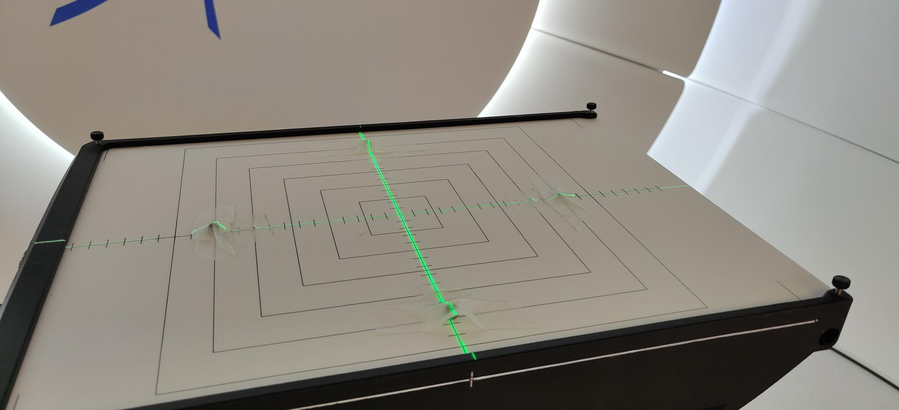

# kV_Field_Analysis
Aauthors: John Wong and Alex Grimwood

Quantifying kV field size at isocentre. Three methods of field edge detection are demonstrated in separate workbooks on a single kV image:  

### Global binary mask 
A binary mask is applied using an empirically derived threshold value. Field sizes are derived from the mask edges.  
  
### Otsu's binary mask
A binary mask is applied using Otsu's method, where a threshold is automatically derived from image histogram variance. Field sizes are derived from the mask edges.  
  
### Gradient threshold
Pixel intensity gradients are generated and used to define the kV field edges.  
  
## Running the notebooks in colab  
Follow the links below to run the notebook demos in Google colab:   
**[Global mask ](https://colab.research.google.com/github/UCLHp/kV_Field_Analysis/blob/demo/kV_Field_Size_Threshold_Method.ipynb)**  
**[Otsu mask](https://colab.research.google.com/github/UCLHp/kV_Field_Analysis/blob/demo/kV_Field_Size_Otsu_Method.ipynb)**  
**[Gradient threshold](https://colab.research.google.com/github/UCLHp/kV_Field_Analysis/blob/demo/kV_Field_Size_Gradient_Method.ipynb)**  
  
